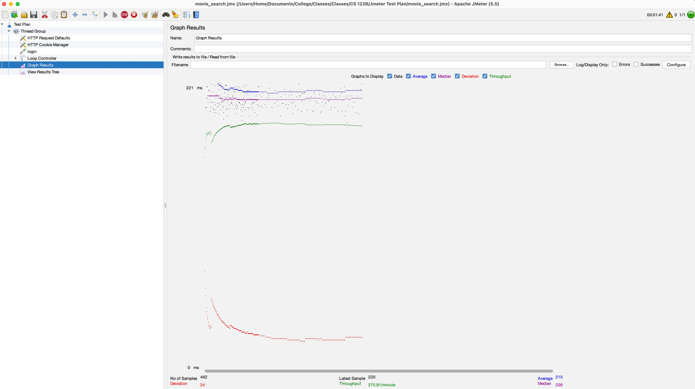
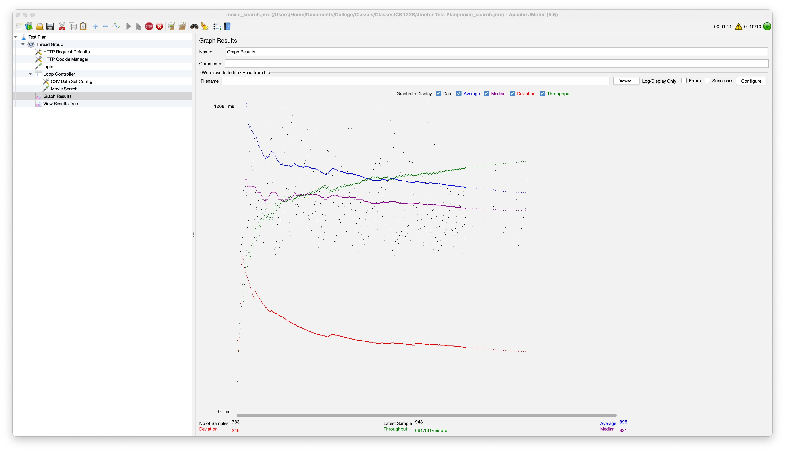
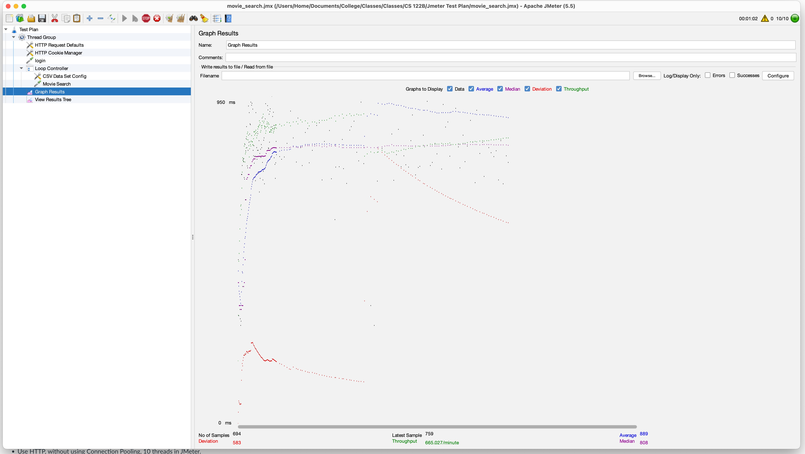
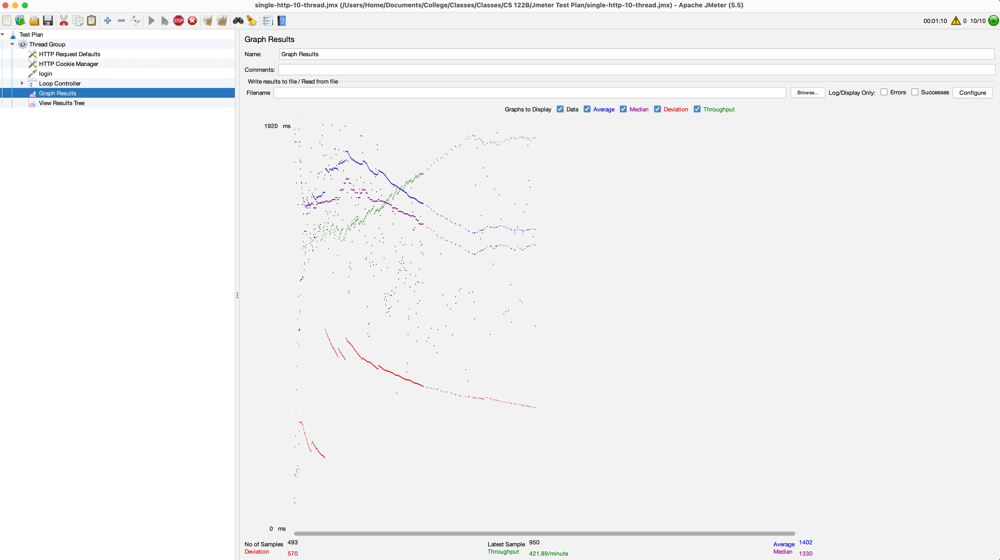
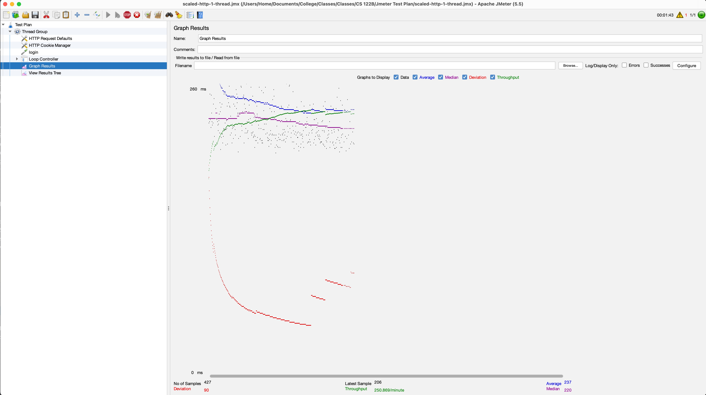
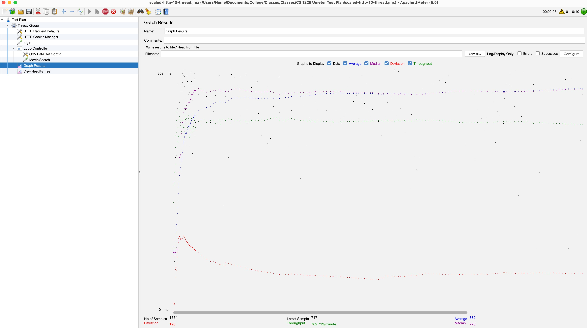
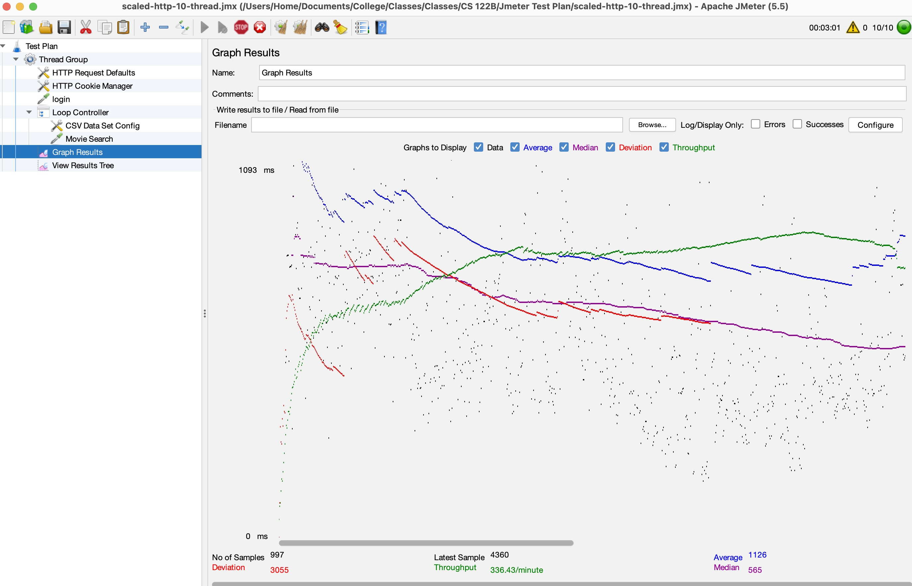

## CS 122B Project 5: Scaling FabFlix and Performance Tuning

- # General
    - #### Team#: stanford_rejects

    - #### Names:
      - ***Team member 1: Tony Liu 34195333***  
      - ***Team member 2: Shengyuan Lu 93188958***

    - #### Project 5 Video Demo Link: [Click here for the demo video]()

    - #### Instruction of deployment:
      - ##### Deploy Remotely
        1. Clone repository: `git@github.com:UCI-Chenli-teaching/s23-122b-stanford_rejects.git`
        2. Change directory to repo with `cd s23-122b-stanford_rejects`
        3. Build war file: `mvn package`
        4. Copy war file onto tomcat: `cp ./target/*.war /home/ubuntu/tomcat/webapps`
        5. Go to the tomcat manager
        6. Launch `/cs122b-fabflix` from the manager
      - ##### Deploy Locally
        1. Clone repository: `git@github.com:UCI-Chenli-teaching/s23-122b-stanford_rejects.git`
        2. Open the repository with IntelliJ
        3. Add a configuration `Tomcat Server`, select `Local`
        4. In the configuration panel, set URL `http://localhost:8080/cs122b_fabflix_war/`, set HTTP port to `8080`, tap `fix` to add `cs122b-fabflix:war` artifact, and enable all logging features
        5. Click `Run` to build and run the application locally in your browser

    - #### Collaborations and Work Distribution:
      - Tony Liu
        - Task 2
        - Task 3
        - Helped prepare Jmeter and Jmeter test plan
        - Set Up AWS
      - Shengyuan Lu
        - Task 1
        - Preserved recaptcha functionalities
        - Task 4
        - Run the demo

- # Connection Pooling
    - #### Include the filename/path of all code/configuration files in GitHub of using JDBC Connection Pooling.
      - Servlets
        - src/Servlets/ConfirmationServlet.java
        - src/Servlets/DashboardAddMovieServlet.java
        - src/Servlets/DashboardAddStarServlet.java
        - src/Servlets/DashboardLoginServlet.java
        - src/Servlets/DashboardMetadataServlet.java
        - src/Servlets/GenreServlet.java
        - src/Servlets/LoginServlet.java
        - src/Servlets/MovieListServlet.java
        - src/Servlets/MovieSuggestionServlet.java
        - src/Servlets/PaymentServlet.java
        - src/Servlets/ShoppingCartServlet.java
        - src/Servlets/SingleMovieServlet.java
        - src/Servlets/SingleStarServlet.java
      - Database Handler
        - src/Helpers/DatabaseHandler.java
      - Configuration Files
        - WebContent/META-INF/context.xml

    - #### Explain how Connection Pooling is utilized in the FabFlix code.
    When a servlet is initialized, we run `dataSource = (DataSource) new InitialContext().lookup("java:comp/env/jdbc/moviedb");` to get a data source which is registered in `context.xml`
    Because of our unique design, connection is only created in `DatabaseHandler.java`. In the servlet file, a database handler is initialized using `DatabaseHandler DBHandler = new DatabaseHandler(dataSource);`
    From the database handler, a connection is leased, and prepared statements created:
    `try (Connection conn = dataSource.getConnection())
    PreparedStatement preparedStatement = conn.prepareStatement(query);`
    The prepared statements are cached by set up `cachePrepStmts=true` in `context.xml`
    The "try with resources" approach will automatically close the connection, thus return it to the connection pool.

    - #### Explain how Connection Pooling works with two backend SQL.
    When accessing using load balancer, we establish a database connection to either the Master or Slave's database. Then, the process is the same as described above in the `Explain how Connection Pooling is utilized in the FabFlix code` section, effectively saving resources by avoiding the need to create and close connections repeatedly.

- # Master/Slave
    - #### Include the filename/path of all code/configuration files in GitHub of routing queries to Master/Slave SQL.
      - Servlets
        - src/Servlets/ConfirmationServlet.java
        - src/Servlets/DashboardAddMovieServlet.java
        - src/Servlets/DashboardAddStarServlet.java
        - src/Servlets/DashboardLoginServlet.java
        - src/Servlets/DashboardMetadataServlet.java
        - src/Servlets/GenreServlet.java
        - src/Servlets/LoginServlet.java
        - src/Servlets/MovieListServlet.java
        - src/Servlets/MovieSuggestionServlet.java
        - src/Servlets/PaymentServlet.java
        - src/Servlets/ShoppingCartServlet.java
        - src/Servlets/SingleMovieServlet.java
        - src/Servlets/SingleStarServlet.java
      - Configuration Files
        - WebContent/META-INF/context.xml
    - #### How read/write requests were routed to Master/Slave SQL?
      - Servlets that perform only reading from database has the data source as either master or slave SQL database, and the corresponding database connections are established, allowing for the routing of queries to either master or slave SQL
      - Servlets that perform updating database (`DashboardAddMovieServlet` and `DashboardAddStarServlet`) has the data source as the master SQL database, so that they can only write to DB on the master instance, and the changes are then propagated to the slave

- # JMeter TS/TJ Time Logs
    - #### Instructions of how to use the `log_processing.*` script to process the JMeter logs.
    1. use `cd` command to change the directory where `log_processing.py` located
    2. make sure python is installed
    3. have the location of the log file ready
    4. run `python3 log_processing.py [location_of_log_file]`
    5. average TS and TJ results will be printed out

- # JMeter TS/TJ Time Measurement Report

Note: The free AWS instance frequently freezes when running test plans exceeding certain amount of time. We think that 500 - 1000 TS / TJ data points satisfy the `sufficient number of readings` in the rubric. You can take a look at images in the `img/` folder and logs in the `log/` folder.
The free Amazon instance's performance fluctuate frequently, making accurate measurements difficult. While there are some inconsistencies, in general we feel confident about our measurements.

| **Single-instance Version Test Plan**         | **Graph Results Screenshot**             | **Average Query Time(ms)** | **Average Search Servlet Time(ms)** | **Average JDBC Time(ms)** | **Analysis**                                                                                                                                                                                                                                                                                                                                                                                        |
|-----------------------------------------------|------------------------------------------|----------------------------|-------------------------------------|---------------------------|-----------------------------------------------------------------------------------------------------------------------------------------------------------------------------------------------------------------------------------------------------------------------------------------------------------------------------------------------------------------------------------------------------|
| Case 1: HTTP/1 thread                         |         | 215                        | 79.86581738414635                   | 79.28440775406504         | This is a very standard case. We noticed that there's not much difference in TS and TJ. The entire tests run is the most smooth as there's not much stress on the server.                                                                                                                                                                                                                           |
| Case 2: HTTP/10 threads                       |        | 895                        | 724.122489074248                    | 723.2768001917293         | We notice that with 10 threads, TS / TJ are about 10x compare to the test with a single thread / http. The difference between TS and TJ increased. Still a very smooth experience possibly due to connection pooling.                                                                                                                                                                               |
| Case 3: HTTPS/10 threads                      |       | 889                        | 611.4649128770116                   | 610.8658734793104         | We notice that the TS / TJ is smaller compare to the test with 10 threads / http, but the average query time stayed relatively the same. We looked up online and found https is generally slower than the http. Our test result contradicts this finding possibly because we restarted the server once before this test run, and it makes the server run faster. The test run is relatively smooth. |
| Case 4: HTTP/10 threads/No connection pooling |  | 1402                       | 1202.374716446602                   | 1200.8125347262137        | Query time, TS / TJ all increased dramatically for about 50% compare to the test with connection pooling. The test run feels a bit laggy and the server become responsive for a while afterwards when we tried to retrieve the log. This indicates that connection pooling can significantly increase performance.                                                                                  |                                                                                                                                                                                       |

| **Scaled Version Test Plan**                  | **Graph Results Screenshot**             | **Average Query Time(ms)** | **Average Search Servlet Time(ms)** | **Average JDBC Time(ms)** | **Analysis**                                                                                                                                                                                                                                                                                                                                                                                                                                                                |
|-----------------------------------------------|------------------------------------------|----------------------------|-------------------------------------|---------------------------|-----------------------------------------------------------------------------------------------------------------------------------------------------------------------------------------------------------------------------------------------------------------------------------------------------------------------------------------------------------------------------------------------------------------------------------------------------------------------------|
| Case 1: HTTP/1 thread                         |         | 237                        | 83.83909550438597                   | 82.52897304166667         | This case runs very similarly to the case 1 in the single-instance version. There is no noticeable performance increase. The numbers are very similar and in our case even a little slower. This is mainly due to the fact that there is only 1 thread.                                                                                                                                                                                                                     |
| Case 2: HTTP/10 threads                       |        | 782                        | 631.1701772425774                   | 630.5999798307013         | We notice a performance increase of about 100 ms average query time decrease, and 100 ms TS / TJ decrease. This indicates that using a load balancer will make the website run more efficiently when the number of users increase. However, we also noticed that the load balancer will sometimes redirect ALL traffic to either master or slave. We investigated and temporary fixed it by run `sudo service apache2 restart` every time we need to use the load balancer. |
| Case 3: HTTP/10 threads/No connection pooling |  | 1126                       | 1076.7664729496473                  | 1063.4746535941592        | Again, we notice a performance increase of about 150 ms average query time decrease, and 150 ms TS / TJ decrease. However, compare to case 2, we noticed a 500 ms performance decrease. This again concludes that connection pooling and load balancing can significantly increase performance.                                                                                                                                                                             |